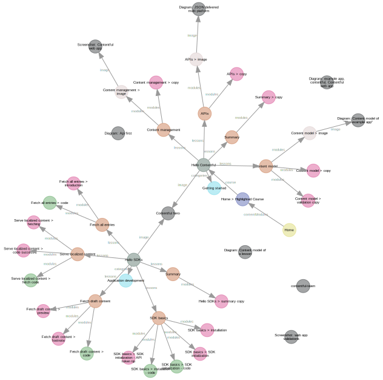

This repository contains code accompanying my [blog post] about generating
directed graphs using [Graphviz] visualizing a [Contentful] space's structured
content (entries and assets).


## Example

Have a look at the [examples folder](examples) for an already exported Contentful
space containing the Contentful example apps space data. This json file can used to
try this tool without you exporting your own space data first:

```js
node src/index.js examples/space.cf-example-app.json | dot -o graph.svg -T svg -K neato
```

_graph.svg_:




## Working with the code
First, download this repository and install all dependencies:

```bash
git clone https://github.com/DanweDE/contentful-content-graphs-graphviz.git
cd contentful-content-graphs-graphviz
npm install
```

To better follow the blog post you can checkout the respective branch for each step,
e.g. `git checkout blog-post/step-3`.


### Exporting a Contentful space
To export a Contentful space of your choice to work with, run

```js
node util/export-space.js --file=space.json --space=CF_SPACE_ID --token=CF_CMA_TOKEN
```

or use the [Contentful export tool][contentful-export] cli directly.


### Generating dot (Graphviz) markup
With the _space.json_ created in this folder you can run:

```js
node src/index.js space.json
```

This takes the previous step's _space.json_ and prints the _dot_ markup for a graph.


### Drawing the graph

The generated dot markup can either be copy pasted to [viz-js.com](http://viz-js.com)
or it can be processed by a local [Graphviz installation][install Graphviz]:

```js
node src/index.js | dot -o graph.svg -T svg -K dot
```

Instead of `-K dot` any other Graphviz layout engine like `neato`, `fdp` or `circo`
can be used to influence the layout of the generated graph.

[blog post]: https://www.contentful.com/blog/2018/05/04/using-graphviz-to-visualize-structured-content-from-contentful-spaces
[Contentful]: https://contentful.com
[contentful-export]: https://github.com/contentful/contentful-export
[Graphviz]: https://www.graphviz.org
[install Graphviz]: https://graphviz.gitlab.io/download
